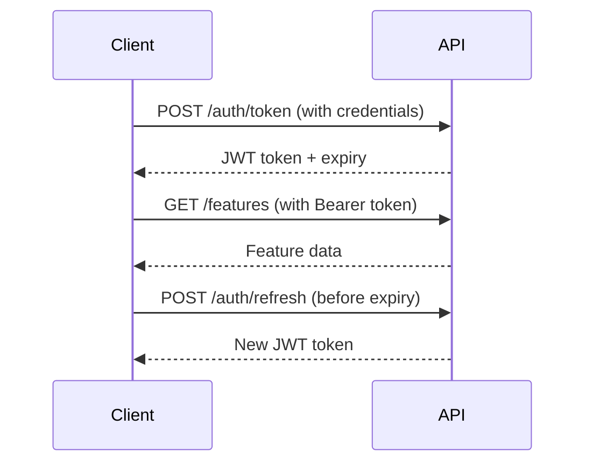

# Feature FM API Documentation - Sandbox Environment

## Overview

Feature FM is a comprehensive feature management platform that enables controlled feature rollouts, A/B testing, and dynamic configuration management. This documentation covers the sandbox environment API, which is used for testing and development before deploying to production.

The Feature FM API provides programmatic access to:

- Feature flag management and configuration
- Audience targeting and segmentation
- Analytics and usage tracking
- Webhook integration for real-time events
- Complete audit trail of feature changes

## Table of Contents

1. [Prerequisites](#prerequisites)
2. [Quick Start](#quick-start)
3. [Authentication](#authentication)
4. [Core Concepts](#core-concepts)
5. [API Endpoints](#api-endpoints)
6. [Testing Strategy](#testing-strategy)
7. [Error Handling](#error-handling)
8. [Rate Limiting](#rate-limiting)
9. [Webhooks](#webhooks)
10. [Best Practices](#best-practices)
11. [Troubleshooting](#troubleshooting)

## Prerequisites

### Required Tools

- **Postman**: Version 9.0+ (Desktop or Web)
- **API Credentials**: Provided for sandbox environment
- **Network Access**: HTTPS access to `api.sandbox-precise.digital`

### Sandbox Environment Details

| Environment | Base URL                              | Purpose                 |
| ----------- | ------------------------------------- | ----------------------- |
| Sandbox     | `https://api.sandbox-precise.digital` | Testing and development |
| Production  | `https://api.precise.digital`         | Live feature management |

## Quick Start

### 1. Import the Collection

1. Download the `feature_fm_sandbox_collection.json`
2. Open Postman and click "Import"
3. Select the JSON file and import
4. The collection appears in your workspace as "Feature FM API - Sandbox Environment"

### 2. Configure Environment Variables

Create a new Postman environment named "Feature FM Sandbox" with these variables:

```javascript
{
  "baseUrl": "https://api.sandbox-precise.digital",
  "apiKey": "3890d422-882b-486d-9de6-c106d9951094",
  "secretKey": "mf1x4y13dgnqmcm3v9x7t9fucg7nozil",
  "issuer": "sandbox-precise.digital",
  "accessToken": "", // Auto-populated after authentication
  "tokenExpirationTime": "" // Auto-populated
}
```

### 3. Authenticate

1. Select the "Feature FM Sandbox" environment
2. Navigate to Authentication > Get Access Token
3. Click "Send" to obtain your JWT
4. The token is automatically stored for subsequent requests

### 4. Test the Connection

Run the Health Check endpoint to verify connectivity:

```
GET {{baseUrl}}/health
```

Expected response:

```json
{
  "status": "healthy",
  "environment": "sandbox",
  "timestamp": "2024-01-15T12:00:00Z"
}
```

## Authentication

Feature FM uses JWT (JSON Web Token) authentication with automatic token management.

### Authentication Flow



### Obtaining Access Token

**Endpoint**: `POST /auth/token`

**Request Body**:

```json
{
  "apiKey": "{{apiKey}}",
  "secretKey": "{{secretKey}}",
  "iss": "{{issuer}}"
}
```

**Response**:

```json
{
  "access_token": "eyJhbGciOiJIUzI1NiIs...",
  "token_type": "Bearer",
  "expires_in": 3600
}
```

### Using the Token

Include the token in the Authorization header:

```http
Authorization: Bearer {{accessToken}}
```

### Token Refresh Strategy

The collection includes automatic token management:

- Pre-request scripts check token expiration
- Test scripts store new tokens automatically
- Warning messages appear when token expires soon

## Core Concepts

### Features

Features are the core entities in Feature FM. Each feature represents a toggleable functionality with:

- **Status**: `active`, `inactive`, `beta`, `deprecated`
- **Configuration**: JSON object with feature-specific settings
- **Rollout Percentage**: Gradual rollout control (0-100%)
- **Target Audience**: User segments for controlled exposure

### Audiences

Audiences define user segments for targeted feature rollouts:

```json
{
  "name": "Premium Users",
  "rules": [
    {
      "attribute": "subscription_tier",
      "operator": "equals",
      "value": "premium"
    }
  ],
  "matchType": "all" // all|any
}
```

### Feature Lifecycle

1. **Create**: Define feature with initial configuration
2. **Configure**: Set targeting rules and rollout percentage
3. **Test**: Validate in sandbox environment
4. **Enable**: Activate for target audience
5. **Monitor**: Track usage and performance
6. **Iterate**: Adjust based on analytics
7. **Deprecate**: Phase out when needed

## API Endpoints

### Features Management

#### List Features

`GET /features`

Query parameters:

- `page`: Page number (default: 1)
- `limit`: Results per page (default: 20)
- `status`: Filter by status
- `category`: Filter by category
- `search`: Search term

Example response:

```json
{
  "data": [
    {
      "id": "feat_123",
      "name": "Dark Mode",
      "status": "active",
      "configuration": {
        "enabled": true,
        "rolloutPercentage": 100
      },
      "createdAt": "2024-01-10T10:00:00Z"
    }
  ],
  "pagination": {
    "page": 1,
    "limit": 20,
    "total": 45,
    "totalPages": 3
  }
}
```

#### Create Feature

`POST /features`

Request body:

```json
{
  "name": "New Feature",
  "description": "Feature description",
  "category": "experimental",
  "status": "beta",
  "configuration": {
    "enabled": false,
    "rolloutPercentage": 0,
    "targetAudience": "internal",
    "settings": {
      "customProperty": "value"
    }
  },
  "tags": ["sandbox", "test"]
}
```

#### Update Feature

`PUT /features/:featureId`

Updates entire feature configuration.

#### Toggle Feature

`PATCH /features/:featureId/toggle`

Quick enable/disable without changing configuration:

```json
{
  "enabled": true
}
```

#### Delete Feature

`DELETE /features/:featureId`

Permanently removes a feature (sandbox only).

### Audience Management

#### Create Audience

`POST /audiences`

Define targeting rules:

```json
{
  "name": "Beta Testers",
  "description": "Early adopters",
  "rules": [
    {
      "attribute": "beta_enrolled",
      "operator": "equals",
      "value": true
    },
    {
      "attribute": "account_age_days",
      "operator": "greater_than",
      "value": 30
    }
  ],
  "matchType": "all"
}
```

Supported operators:

- `equals`
- `not_equals`
- `greater_than`
- `less_than`
- `contains`
- `in`
- `not_in`

### Analytics

#### Feature Usage Analytics

`GET /analytics/features/:featureId`

Query parameters:

- `startDate`: YYYY-MM-DD format
- `endDate`: YYYY-MM-DD format
- `granularity`: `hourly`, `daily`, `weekly`, `monthly`

Response includes:

```json
{
  "featureId": "feat_123",
  "metrics": {
    "totalRequests": 10000,
    "uniqueUsers": 2500,
    "enabledRequests": 9500,
    "conversionRate": 0.45
  },
  "timeSeries": [
    {
      "timestamp": "2024-01-15T00:00:00Z",
      "requests": 500,
      "users": 125
    }
  ]
}
```

#### Export Analytics

`POST /analytics/export`

Generate downloadable reports:

```json
{
  "reportType": "feature_usage",
  "format": "csv",
  "dateRange": {
    "start": "2024-01-01",
    "end": "2024-01-31"
  },
  "email": "team@example.com"
}
```

### Webhooks

#### Register Webhook

`POST /webhooks`

```json
{
  "url": "https://your-app.com/webhooks/feature-fm",
  "events": ["feature.created", "feature.updated", "feature.toggled", "feature.deleted"],
  "active": true,
  "retryPolicy": {
    "maxRetries": 3,
    "retryDelay": 60
  }
}
```

Available events:

- `feature.created`
- `feature.updated`
- `feature.toggled`
- `feature.deleted`
- `feature.rollout_changed`
- `audience.created`
- `audience.updated`
- `audience.deleted`

## Testing Strategy

### Test Organization

The collection includes comprehensive test coverage:

1. **Authentication Tests**
   - Token generation validation
   - Token expiration checks
   - Refresh token flow

2. **Feature Tests**
   - CRUD operations
   - Status transitions
   - Configuration validation

3. **Integration Tests**
   - Feature-audience associations
   - Analytics data consistency
   - Webhook delivery

### Automated Testing

Pre-request scripts handle:

```javascript
// Token expiration check
const tokenExpiry = pm.environment.get('tokenExpirationTime');
if (Date.now() > tokenExpiry - 300000) {
  console.warn('Token expiring soon');
}
```

Test scripts validate:

```javascript
// Response validation
pm.test('Feature created successfully', () => {
  pm.response.to.have.status(201);
  const response = pm.response.json();
  pm.expect(response).to.have.property('id');
});
```

### Test Data Management

Sandbox environment provides:

- Automatic data reset every 24 hours
- Test feature prefixes (`test_`, `sandbox_`)
- Safe deletion without production impact

## Error Handling

### Error Response Format

```json
{
  "error": {
    "code": "FEATURE_NOT_FOUND",
    "message": "Feature with ID 'feat_999' does not exist",
    "details": {
      "featureId": "feat_999",
      "timestamp": "2024-01-15T12:00:00Z"
    }
  },
  "requestId": "req_abc123xyz"
}
```

### Common Error Codes

| Code                       | HTTP Status | Description                   |
| -------------------------- | ----------- | ----------------------------- |
| `INVALID_CREDENTIALS`      | 401         | Invalid API key or secret     |
| `TOKEN_EXPIRED`            | 401         | JWT has expired               |
| `INSUFFICIENT_PERMISSIONS` | 403         | Action not allowed            |
| `FEATURE_NOT_FOUND`        | 404         | Feature doesn't exist         |
| `DUPLICATE_FEATURE`        | 409         | Feature name already exists   |
| `INVALID_CONFIGURATION`    | 400         | Invalid feature configuration |
| `RATE_LIMIT_EXCEEDED`      | 429         | Too many requests             |

### Error Recovery Strategies

1. **401 Unauthorized**: Refresh token or re-authenticate
2. **429 Rate Limited**: Implement exponential backoff
3. **5xx Server Errors**: Retry with idempotency key

## Rate Limiting

### Limits

| Plan       | Requests/Hour | Burst Limit | Concurrent Connections |
| ---------- | ------------- | ----------- | ---------------------- |
| Sandbox    | 1,000         | 100/min     | 10                     |
| Production | 10,000        | 1,000/min   | 100                    |

### Rate Limit Headers

```http
X-RateLimit-Limit: 1000
X-RateLimit-Remaining: 950
X-RateLimit-Reset: 1673784000
```

### Handling Rate Limits

```javascript
// Exponential backoff implementation
async function retryWithBackoff(request, maxRetries = 3) {
  for (let i = 0; i < maxRetries; i++) {
    try {
      return await makeRequest(request);
    } catch (error) {
      if (error.status === 429 && i < maxRetries - 1) {
        const delay = Math.pow(2, i) * 1000;
        await sleep(delay);
      } else {
        throw error;
      }
    }
  }
}
```

## Webhooks

### Webhook Payload Structure

```json
{
  "event": "feature.updated",
  "timestamp": "2024-01-15T12:00:00Z",
  "data": {
    "feature": {
      "id": "feat_123",
      "name": "Dark Mode",
      "previousStatus": "beta",
      "currentStatus": "active"
    }
  },
  "metadata": {
    "webhookId": "webhook_456",
    "deliveryId": "delivery_789"
  }
}
```

### Webhook Security

Verify webhook signatures:

```javascript
const crypto = require('crypto');

function verifyWebhook(payload, signature, secret) {
  const expectedSignature = crypto.createHmac('sha256', secret).update(payload).digest('hex');

  return crypto.timingSafeEqual(Buffer.from(signature), Buffer.from(expectedSignature));
}
```

## Best Practices

### Feature Flag Naming

Use clear, consistent naming:

- `feature_` prefix for features
- `experiment_` prefix for A/B tests
- `kill_` prefix for kill switches

Examples:

- `feature_dark_mode`
- `experiment_checkout_flow_v2`
- `kill_payment_processing`

### Configuration Management

Structure feature configurations consistently:

```json
{
  "enabled": boolean,
  "rolloutPercentage": number,
  "targetAudience": string,
  "settings": {
    // Feature-specific settings
  },
  "metadata": {
    "owner": "team-name",
    "jiraTicket": "FEAT-123"
  }
}
```

### Gradual Rollouts

Follow safe rollout practices:

1. Start with internal users (0%)
2. Beta testers (5-10%)
3. Small percentage (10-25%)
4. Half rollout (50%)
5. Full rollout (100%)

### Monitoring and Alerting

Track key metrics:

- Feature adoption rate
- Error rates per feature
- Performance impact
- User feedback scores

## Troubleshooting

### Common Issues

#### Token Expiration During Testing

**Problem**: Token expires mid-testing session

**Solution**:

1. Check console warnings for expiration alerts
2. Run "Refresh Token" request
3. Consider implementing auto-refresh in pre-request scripts

#### Feature Not Appearing

**Problem**: Created feature doesn't show in list

**Solution**:

1. Check feature status filter
2. Verify pagination parameters
3. Confirm feature creation succeeded
4. Check audience targeting rules

#### Webhook Not Receiving Events

**Problem**: Webhook endpoint not called

**Solution**:

1. Verify webhook is active
2. Check event subscriptions
3. Test with webhook testing tool
4. Review webhook logs in dashboard

#### Analytics Data Missing

**Problem**: No analytics data for feature

**Solution**:

1. Ensure feature has been enabled
2. Check date range parameters
3. Allow time for data processing (5-10 minutes)
4. Verify feature has actual usage

### Debug Mode

Enable debug logging in requests:

```javascript
// Add to pre-request script
pm.environment.set('debug', true);

// In request headers
{
  "X-Debug-Mode": "{{debug}}"
}
```

### Support Resources

- **API Status**: `https://status.sandbox-precise.digital`
- **Documentation**: This guide
- **Support Email**: `support@feature-fm.com`
- **Community Forum**: `https://community.feature-fm.com`

## Sandbox Environment Limitations

The sandbox environment has some intentional limitations:

1. **Data Persistence**: Resets every 24 hours
2. **Rate Limits**: Lower than production
3. **Webhook Delivery**: May have delays
4. **Analytics**: Limited to 30-day retention
5. **Performance**: Not optimized for load testing

## Migration to Production

When ready to move to production:

1. **Export Configurations**: Use analytics export endpoint
2. **Update Credentials**: Obtain production API keys
3. **Change Base URL**: Update to production endpoint
4. **Adjust Rate Limits**: Plan for production traffic
5. **Enable Monitoring**: Set up production alerts
6. **Test Thoroughly**: Verify all integrations

## Version History

| Version | Date       | Changes                  |
| ------- | ---------- | ------------------------ |
| 1.0.0   | 2024-01-15 | Initial sandbox release  |
| 1.1.0   | 2024-02-01 | Added audience targeting |
| 1.2.0   | 2024-03-01 | Analytics endpoints      |
| 1.3.0   | 2024-04-01 | Webhook support          |

## Appendix

### Sample Test Scenarios

#### Scenario 1: Feature Rollout

```javascript
// 1. Create feature (disabled)
POST /features
{
  "name": "new_checkout_flow",
  "status": "beta",
  "configuration": {
    "enabled": false,
    "rolloutPercentage": 0
  }
}

// 2. Create audience
POST /audiences
{
  "name": "beta_testers",
  "rules": [...]
}

// 3. Update feature with audience
PUT /features/feat_123
{
  "configuration": {
    "targetAudience": "aud_456"
  }
}

// 4. Gradual rollout
PATCH /features/feat_123/toggle
{
  "enabled": true,
  "rolloutPercentage": 10
}

// 5. Monitor analytics
GET /analytics/features/feat_123
```

#### Scenario 2: Kill Switch Implementation

```javascript
// Create kill switch
POST /features
{
  "name": "kill_payment_provider_x",
  "category": "operational",
  "status": "active",
  "configuration": {
    "enabled": false,
    "priority": "critical"
  }
}

// Emergency activation
PATCH /features/kill_123/toggle
{
  "enabled": true
}
```

### Performance Benchmarks

Expected response times in sandbox:

| Endpoint          | P50   | P95   | P99    |
| ----------------- | ----- | ----- | ------ |
| GET /features     | 50ms  | 150ms | 300ms  |
| POST /features    | 100ms | 250ms | 500ms  |
| GET /analytics/\* | 200ms | 500ms | 1000ms |

---

_This documentation covers the Feature FM sandbox API. For production documentation and advanced features, refer to the production API guide._
