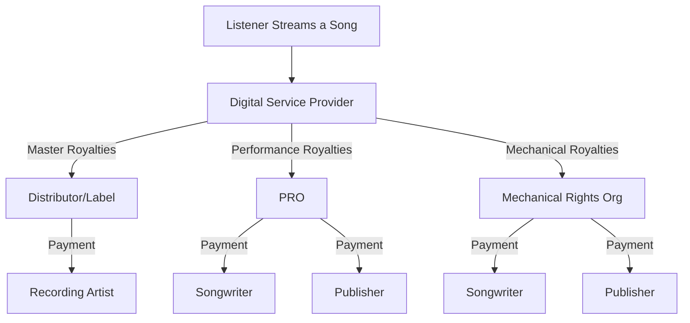
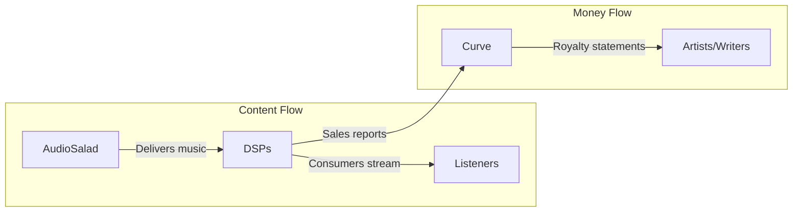

# Music Industry Onboarding Guide

A foundational guide for new team members without prior music industry experience. This document introduces core concepts, terminology, and recommended learning resources to help you understand the business context of our work.

## Table of Contents

1. [Introduction](#1-introduction)
2. [Understanding Music Rights](#2-understanding-music-rights)
3. [Types of Royalties](#3-types-of-royalties)
4. [The Music Industry Value Chain](#4-the-music-industry-value-chain)
5. [Digital Service Providers (DSPs)](#5-digital-service-providers-dsps)
6. [Music Metadata and Identifiers](#6-music-metadata-and-identifiers)
7. [Our Technology Stack in Context](#7-our-technology-stack-in-context)
8. [Recommended Learning Resources](#8-recommended-learning-resources)
9. [Glossary of Key Terms](#9-glossary-of-key-terms)

---

## 1. Introduction

The music industry operates on a complex system of rights, royalties, and relationships between artists, labels, publishers, distributors, and digital platforms. Understanding these fundamentals is essential for working effectively at Precise Digital, where our technology supports music businesses in managing their catalogues, distributing content, and tracking royalties.

This guide will help you:

- Understand the two types of music rights and why they matter
- Learn how different royalty streams flow from listeners to creators
- Recognise key industry players and their roles
- Familiarise yourself with essential terminology and identifiers
- Connect our technical work to real business outcomes

---

## 2. Understanding Music Rights

When a song is created, **two separate copyrights** are established:

### Composition Rights (Publishing)

The **composition** (also called the "song" or "work") refers to the underlying musical elements:

- Lyrics
- Melody
- Harmonies
- Musical arrangement

These rights belong to **songwriters** and their **publishers**. A song can have multiple writers, each owning a percentage of the composition.

### Master Rights (Recording)

The **master recording** (also called the "master" or "sound recording") is the specific recorded version of a composition:

- The actual audio file
- The specific performance captured
- Production and mixing choices

These rights typically belong to **recording artists** and their **record labels**.

```
┌─────────────────────────────────────────────────────────────────┐
│                         ONE SONG                                │
├─────────────────────────────┬───────────────────────────────────┤
│     COMPOSITION             │        MASTER RECORDING           │
│     (The Song)              │        (The Recording)            │
├─────────────────────────────┼───────────────────────────────────┤
│  • Lyrics & melody          │  • Specific audio recording       │
│  • Owned by: Songwriter(s)  │  • Owned by: Artist/Label         │
│  • Managed by: Publisher    │  • Managed by: Distributor        │
│  • Generates: Publishing    │  • Generates: Master royalties    │
│    royalties                │                                   │
└─────────────────────────────┴───────────────────────────────────┘
```

**Why this matters**: A single song can generate multiple royalty streams. For example, when someone streams a track on Spotify, royalties are owed to both the songwriter (composition) AND the recording artist/label (master). These are tracked and paid separately.

---

## 3. Types of Royalties

Understanding royalty types is fundamental to our work. Here are the main categories:

### Performance Royalties

Generated when a composition is **performed publicly**:

- Radio airplay (terrestrial and digital)
- Live performances at venues
- Background music in businesses
- Streaming on non-interactive services (like Pandora)

**Collected by**: Performing Rights Organisations (PROs) such as PRS (UK), ASCAP/BMI/SESAC (US), APRA (Australia)

**Paid to**: Songwriters and publishers

### Mechanical Royalties

Generated when a composition is **reproduced**:

- On-demand streaming (Spotify, Apple Music)
- Digital downloads
- Physical sales (CD, vinyl)

**Collected by**: Mechanical rights organisations such as MCPS (UK), The MLC (US), Harry Fox Agency

**Paid to**: Songwriters and publishers

### Master Recording Royalties

Generated from the use of the **actual recording**:

- Streaming revenue share
- Download sales
- Physical sales
- Sync licensing (TV, film, advertising)

**Collected by**: Distributors (like AudioSalad) and labels

**Paid to**: Recording artists and labels

### Synchronisation (Sync) Royalties

Generated when music is **synchronised with visual media**:

- Film and television
- Advertisements
- Video games
- YouTube videos

**Paid to**: Both composition rights holders (publisher) AND master rights holders (label)



---

## 4. The Music Industry Value Chain

### Key Players

| Role                      | Description                                          | Examples                                           |
| ------------------------- | ---------------------------------------------------- | -------------------------------------------------- |
| **Artist**                | Creates and performs music                           | Independent artists, signed acts                   |
| **Songwriter**            | Writes lyrics and/or music                           | May or may not be the performing artist            |
| **Record Label**          | Funds, produces, and markets recordings              | Major: Universal, Sony, Warner; Independent labels |
| **Publisher**             | Manages composition rights, secures sync deals       | Major: Sony/ATV, Universal Music Publishing        |
| **Distributor**           | Delivers music to DSPs and collects master royalties | AudioSalad, DistroKid, TuneCore, The Orchard       |
| **DSP**                   | Streams/sells music to consumers                     | Spotify, Apple Music, Amazon Music                 |
| **PRO**                   | Collects and distributes performance royalties       | PRS, ASCAP, BMI                                    |
| **Royalty Administrator** | Tracks and processes royalty payments                | Curve Royalty Systems                              |

### The Release Journey


---

## 5. Digital Service Providers (DSPs)

DSPs are platforms that deliver music to consumers. They are the primary source of streaming revenue in today's music industry.

### Major DSPs

| DSP               | Type                      | Notes                          |
| ----------------- | ------------------------- | ------------------------------ |
| **Spotify**       | Interactive streaming     | Largest global market share    |
| **Apple Music**   | Interactive streaming     | Strong in US market            |
| **Amazon Music**  | Interactive streaming     | Bundled with Prime             |
| **YouTube Music** | Interactive streaming     | Integrated with video platform |
| **TIDAL**         | Interactive streaming     | HiFi audio focus               |
| **Deezer**        | Interactive streaming     | Strong in Europe               |
| **Pandora**       | Non-interactive streaming | US-focused, radio-style        |
| **SiriusXM**      | Non-interactive streaming | Satellite and digital radio    |

### Interactive vs Non-Interactive

**Interactive (On-Demand)**: User chooses specific songs

- Generates both mechanical AND performance royalties for compositions
- Examples: Spotify, Apple Music, Amazon Music

**Non-Interactive (Radio-style)**: Platform selects songs

- Generates only performance royalties for compositions
- Examples: Pandora Free, iHeartRadio

---

## 6. Music Metadata and Identifiers

Accurate metadata ensures proper royalty distribution. Missing or incorrect metadata is a leading cause of unclaimed royalties in the industry.

### Key Identifiers

| Identifier  | Full Name                                | Purpose                                     |
| ----------- | ---------------------------------------- | ------------------------------------------- |
| **ISRC**    | International Standard Recording Code    | Uniquely identifies a specific recording    |
| **ISWC**    | International Standard Musical Work Code | Uniquely identifies a composition           |
| **UPC/EAN** | Universal Product Code                   | Identifies a release/album (like a barcode) |
| **IPI**     | Interested Party Information             | Identifies songwriters and publishers       |
| **ISNI**    | International Standard Name Identifier   | Identifies contributors (artists, writers)  |

### Essential Metadata Fields

**Release Level:**

- Release title
- UPC/EAN
- Release date
- Label name
- Cover artwork
- Genre

**Track Level:**

- Track title
- ISRC
- Duration
- Track number
- Explicit content flag

**Rights Information:**

- P-Line (Sound recording copyright): ℗ 2024 Label Name
- C-Line (Composition copyright): © 2024 Publisher Name
- Participants and their roles

---

## 7. Our Technology Stack in Context

Understanding how our tools fit into the music industry workflow:

### AudioSalad (Distribution Platform)

**What it does**: Manages music catalogues and delivers content to DSPs

**Industry role**: Acts as the **distributor**, sitting between labels/artists and streaming platforms

**Key functions**:

- Catalogue management (releases, tracks, artists)
- Content delivery to DSPs (Spotify, Apple, Amazon, etc.)
- Metadata management
- Asset hosting (audio files, artwork)

See: [AudioSalad API Guide](audiosalad-api-postman-guide.md)

### Curve Royalty Systems

**What it does**: Tracks and processes royalty payments

**Industry role**: Acts as **royalty administrator**, ensuring accurate payments to rights holders

**Key functions**:

- Payee and contract management
- Sales data processing from DSPs
- Royalty calculations based on contract terms
- Statement generation for artists and writers
- Cost tracking and deductions

See: [Curve Royalty API Guide](curve-royalty-api-postman-guide.md)

### How They Work Together



---

## 8. Recommended Learning Resources

### Essential Courses

#### The MLC 101: An Introduction to The MLC

- **Provider**: The Mechanical Licensing Collective
- **Duration**: ~2.5 hours
- **Cost**: Free (requires .edu email)
- **Focus**: Understanding mechanical royalties and The MLC's role in the US market
- **Access**: [themlc.com/students](https://www.themlc.com/students)

#### Curve Certified for Record Labels

- **Provider**: Curve Royalty Systems
- **Focus**: Complete training on using Curve for royalty management
- **Covers**:
  - Client and payee setup
  - Contract creation and management
  - Catalogue organisation
  - Sales processing and statement delivery
  - Advanced reporting and analytics
- **Access**: [Curve Teachable](https://curveroyaltysystems.teachable.com/)

### Industry Reading

| Resource                     | Description                    | Link                                                                  |
| ---------------------------- | ------------------------------ | --------------------------------------------------------------------- |
| **Music Business Worldwide** | Industry news and analysis     | [musicbusinessworldwide.com](https://www.musicbusinessworldwide.com/) |
| **Hypebot**                  | Music industry technology news | [hypebot.com](https://www.hypebot.com/)                               |
| **Complete Music Update**    | Daily industry news            | [completemusicupdate.com](https://completemusicupdate.com/)           |
| **IFPI Global Music Report** | Annual industry statistics     | [ifpi.org](https://www.ifpi.org/resources/)                           |

### Terminology References

- [Revelator Music Industry Glossary](https://revelator.com/resources/music-industry-glossary/) - Comprehensive A-Z of industry terms
- [Songtrust Knowledge Base](https://help.songtrust.com/) - Publishing-focused explanations

---

## 9. Glossary of Key Terms

### A-D

| Term                   | Definition                                                        |
| ---------------------- | ----------------------------------------------------------------- |
| **Advance**            | Upfront payment to an artist/writer against future royalties      |
| **A&R**                | Artists and Repertoire - talent scouting and artist development   |
| **Blanket License**    | License covering all works in a catalogue for a set fee           |
| **Catalogue**          | A collection of musical works or recordings                       |
| **Collection Society** | Organisation that collects and distributes royalties (PROs, MROs) |
| **Copyright**          | Legal right to control use of a creative work                     |
| **Cover Song**         | New recording of a previously released song                       |
| **DDEX**               | Digital Data Exchange - standard format for music metadata        |
| **Distributor**        | Company that delivers music to DSPs and retail                    |
| **DSP**                | Digital Service Provider - streaming/download platform            |

### E-M

| Term                   | Definition                                                         |
| ---------------------- | ------------------------------------------------------------------ |
| **Exploitation**       | Commercial use of a musical work (not negative in this context)    |
| **ISRC**               | International Standard Recording Code - identifies recordings      |
| **ISWC**               | International Standard Musical Work Code - identifies compositions |
| **Label**              | Record label - company that releases and markets recordings        |
| **Licensee**           | Party receiving permission to use music                            |
| **Licensor**           | Rights holder granting permission to use music                     |
| **Master**             | The original/official recording of a song                          |
| **Mechanical Royalty** | Payment for reproduction of a composition                          |
| **Metadata**           | Information describing a recording (title, artist, ISRC, etc.)     |

### N-R

| Term                    | Definition                                                      |
| ----------------------- | --------------------------------------------------------------- |
| **Neighbouring Rights** | Rights of performers and producers in a recording               |
| **P-Line**              | Sound recording copyright notice (℗)                            |
| **C-Line**              | Composition copyright notice (©)                                |
| **Performance Royalty** | Payment for public performance of a composition                 |
| **PRO**                 | Performing Rights Organisation (PRS, ASCAP, BMI)                |
| **Publisher**           | Company managing composition rights                             |
| **Recoupment**          | Recovery of advances from royalty earnings                      |
| **Release**             | A product containing one or more recordings (single, EP, album) |
| **Royalty**             | Payment to rights holders for use of their work                 |

### S-Z

| Term                       | Definition                                              |
| -------------------------- | ------------------------------------------------------- |
| **Sample**                 | Portion of an existing recording used in a new work     |
| **Split**                  | Percentage ownership of a song between multiple writers |
| **Streaming**              | Real-time audio playback over the internet              |
| **Sync (Synchronisation)** | Pairing music with visual media                         |
| **Territory**              | Geographic region for licensing purposes                |
| **Track**                  | Individual song or recording                            |
| **UPC**                    | Universal Product Code - barcode identifying a release  |
| **Work**                   | A musical composition (lyrics and music)                |
| **Writer's Share**         | Portion of royalties paid directly to songwriters       |
| **Publisher's Share**      | Portion of royalties retained by/paid to publishers     |

---

## Next Steps

1. **Complete the recommended courses** - Start with The MLC 101 if available, then Curve Certified
2. **Read through our existing documentation** - Familiarise yourself with [AudioSalad](audiosalad-api-postman-guide.md) and [Curve](curve-royalty-api-postman-guide.md) guides
3. **Ask questions** - The music industry is complex; no one expects you to understand everything immediately
4. **Follow industry news** - Stay current with the resources listed above

---

_This guide provides foundational knowledge. As you work on specific projects, you'll develop deeper understanding of particular areas. Don't hesitate to ask colleagues for clarification or additional context._
