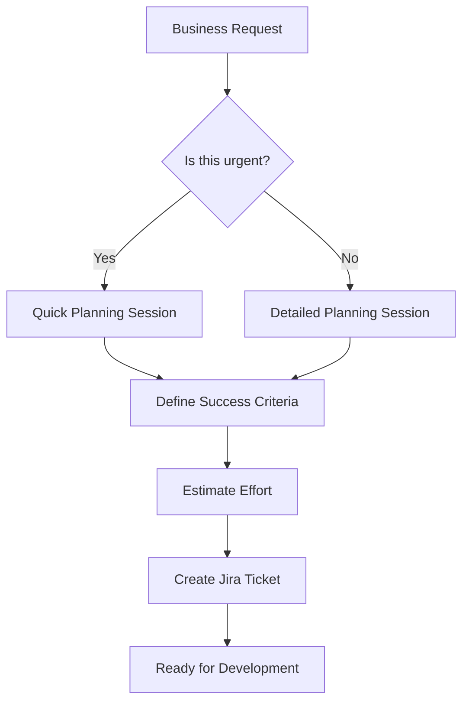
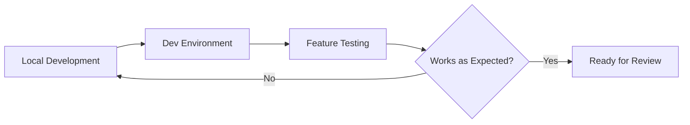
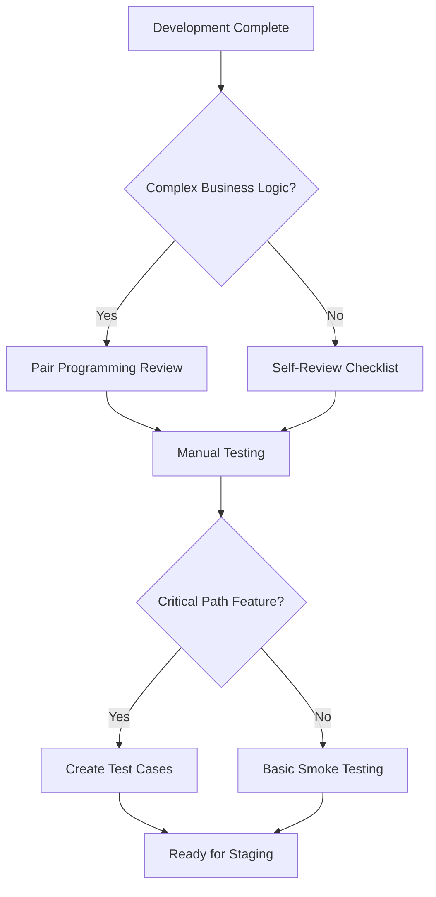
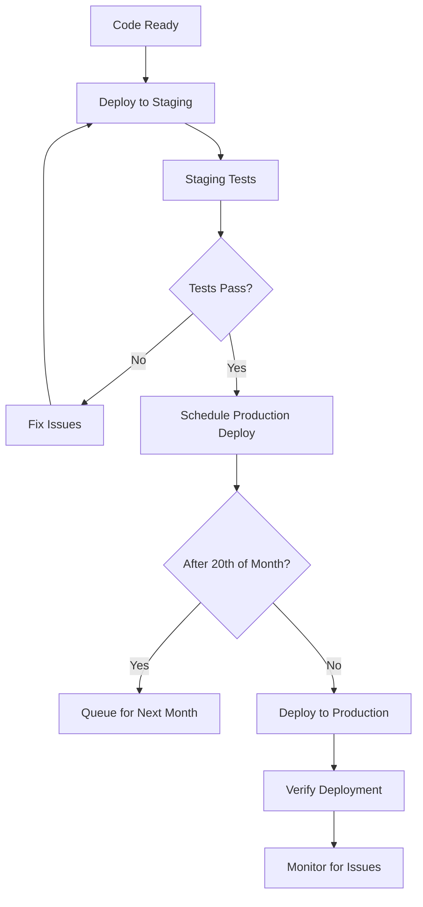
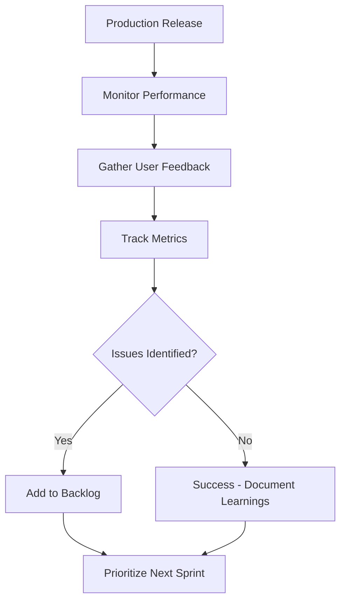

# Software Development Lifecycle Framework
## Visual Guide for Small Development Teams

---

## Current State vs. Desired State

### 🔴 Current State: Idea-to-Production Pipeline
```
💡 Idea → 💻 Code → 🚀 Production → 🔥 Issues → 🛠️ Fix → 📋 Document (Maybe)
    |         |         |           |         |         |
   Quick    Direct    Live         React    Patch     After-fact
  Decision  Implementation Testing   to Issues in Prod  Planning
```

**Characteristics:**
- ✅ Fast initial delivery
- ❌ High stress during critical periods (month-end)
- ❌ Repetitive issues and technical debt
- ❌ Knowledge silos and poor handover capability
- ❌ Difficult to scale team or add features

---

### 🟢 Desired State: Structured Development Cycle
```
💡 Idea → 📋 Plan → 💻 Develop → 🧪 Test → 🚀 Deploy → 📖 Document → 🔄 Iterate
    |       |        |          |        |         |           |
  Business  Success   Dev Env    Staging  Production Knowledge   Continuous
  Context   Criteria  First      Validation Release  Capture    Improvement
```

**Characteristics:**
- ✅ Predictable delivery timelines
- ✅ Reduced production issues
- ✅ Scalable processes for team growth
- ✅ Reduced stress during critical periods
- ✅ Faster feature delivery (after initial investment)

---

## The Six-Phase Framework

### Phase 1: Planning & Requirements 📋
**Time Investment:** 30-60 minutes per feature  
**Current Gap:** Missing entirely



**Key Questions to Answer:**
- What problem are we solving?
- How will we know it's working?
- What could go wrong?
- How long should this take?

**Outputs:**
- Clear acceptance criteria
- Risk identification
- Time estimate
- Jira ticket with context

---

### Phase 2: Development Environment 💻
**Current State:** Ad-hoc development against production-like systems  
**Target State:** Isolated development with fast feedback loops



**Infrastructure Requirements:**
- SA-based servers for <50ms latency
- Separate dev/staging/production environments
- Quick deployment cycles (30 seconds vs 5 minutes)

**Developer Experience:**
- Code → Test → Iterate rapidly
- No fear of breaking production during development
- Real-time debugging capabilities

---

### Phase 3: Code Review & Testing 🧪
**Current Gap:** Limited peer review and testing  
**Minimum Viable Approach:** Focus on critical business logic



**Testing Priorities (Minimum Viable):**
1. **Critical Path:** Statement processing logic
2. **High Risk:** Financial calculations and data integrity
3. **User-Facing:** Dashboard functionality and reports
4. **Lower Priority:** Internal tools and admin features

**Review Checklist:**
- [ ] Does this solve the original problem?
- [ ] Could this break existing functionality?
- [ ] Is the business logic documented?
- [ ] Are error cases handled?

---

### Phase 4: Staging & Deployment 🚀
**Current Gap:** Production-first testing  
**Target:** Staging validation before production release



**Deployment Windows:**
- **Normal Changes:** Any time before 20th of month
- **Emergency Fixes:** Only with CTO approval after 20th
- **Statement Run Period:** Code freeze except critical issues

**Rollback Plan:**
- Always have previous version ready
- Database backup before schema changes
- Feature flags for major functionality changes

---

### Phase 5: Documentation & Knowledge Transfer 📖
**Current Gap:** Minimal documentation, knowledge silos  
**Pragmatic Approach:** Focus on decision capture, not comprehensive docs


**Documentation Priorities:**
1. **Why decisions were made** (most important)
2. **Complex business logic** (financial calculations)
3. **API endpoints and data flows**
4. **Configuration and environment setup**

**Knowledge Transfer Methods:**
- Pair programming during development
- Code walkthrough sessions
- Decision logs in Jira/Confluence
- README files with context

---

### Phase 6: Monitoring & Iteration 🔄
**Target:** Continuous improvement based on real usage  



**Key Metrics to Track:**
- Statement run success rate and timing
- User complaints and support tickets  
- System performance and errors
- Developer time per feature type

---

## Implementation Strategy

### Month 1: Foundation
**Focus:** Planning and Environment Setup
- [ ] Implement 30-minute planning sessions
- [ ] Set up AWS infrastructure for proper dev/staging separation
- [ ] Create basic Jira workflow
- [ ] Establish 20th-of-month change control

### Month 2: Testing & Review
**Focus:** Quality Improvement
- [ ] Implement code review checklist
- [ ] Create test cases for critical business logic
- [ ] Practice staging deployments
- [ ] Document core financial calculations

### Month 3: Full Cycle
**Focus:** Complete Process Adoption
- [ ] Full development lifecycle for new features
- [ ] Regular retrospectives and process refinement
- [ ] Team training on all tools and processes
- [ ] Prepare framework for additional team members

---

## Team Size Considerations

### 2-Person Team (Current)
- **Pair Programming:** Informal review process
- **Shared Ownership:** Both developers understand all systems
- **Flexibility:** Can adapt process based on feature complexity
- **Focus:** Minimum viable process that adds value

### 4-6 Person Team (Growth Target)
- **Formal Code Reviews:** Pull request workflow
- **Specialization:** Domain experts for different areas
- **Process Enforcement:** Stricter adherence to workflow
- **Documentation:** Critical for knowledge sharing

---

## Success Indicators

### Technical Metrics
- **Deployment Frequency:** From monthly to weekly capabilities
- **Lead Time:** From idea to production reduced by 50%
- **Recovery Time:** Issues resolved within 1 business day
- **Change Failure Rate:** <10% of deployments cause issues

### Team Metrics  
- **Planning Accuracy:** Estimates within 25% of actual time
- **Knowledge Sharing:** Any team member can explain core business logic
- **Stress Levels:** Reduced anxiety during month-end statement runs
- **Confidence:** Team comfortable with frequent deployments

### Business Metrics
- **Feature Delivery:** Faster delivery of dashboard/analytics features
- **System Reliability:** 99.9%+ uptime during critical periods
- **Client Satisfaction:** Reduced complaints about system issues
- **Scalability:** Process ready for team growth

---

## Common Pitfalls & Mitigation

### ⚠️ Over-Engineering Process
**Pitfall:** Creating too much structure for a small team  
**Mitigation:** Start minimal, add complexity only when current process breaks

### ⚠️ Tool Proliferation  
**Pitfall:** Adding tools without adoption  
**Mitigation:** Master one tool before adding another

### ⚠️ Documentation Debt
**Pitfall:** Skipping documentation when "urgent" features needed  
**Mitigation:** Make documentation part of "done" definition

### ⚠️ Testing Theater
**Pitfall:** Creating tests that don't catch real issues  
**Mitigation:** Focus on business logic and critical paths first

---

## Framework Flexibility

This framework is **adaptive by design**:

- **Small Features:** Can skip formal planning for 1-hour changes
- **Urgent Fixes:** Emergency process for critical issues
- **Experimentation:** Prototype mode for exploration
- **Legacy Code:** Different standards for maintenance vs new development

**Key Principle:** *Process should enable faster delivery, not slow it down. If a process step isn't adding value, question it.*
