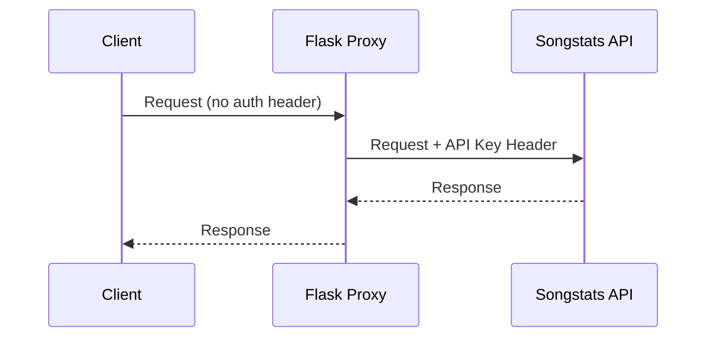

# Songstats API Test Suite - Usage Guide

## Table of Contents

1. [Overview](#overview)
2. [Initial Setup](#initial-setup)
3. [Authentication](#authentication)
4. [Using the Web Dashboard](#using-the-web-dashboard)
5. [Using the CLI Test Suite](#using-the-cli-test-suite)
6. [API Endpoints](#api-endpoints)
7. [Common Workflows](#common-workflows)
8. [Troubleshooting](#troubleshooting)
9. [Best Practices](#best-practices)

---

## Overview

The Songstats API Test Suite is a comprehensive testing and development tool for integrating with the Songstats Enterprise API. It provides both a web-based interactive dashboard and a command-line testing suite, allowing developers to test music industry data endpoints covering artists, tracks, labels, and related entities.

### Key Capabilities

- **Interactive Dashboard**: Web-based interface for real-time API testing
- **CLI Test Suite**: Automated testing with comprehensive endpoint coverage
- **CORS Proxy**: Flask-based proxy server bypassing browser CORS restrictions
- **Postman Collection**: Pre-configured requests for manual API exploration
- **Rate Limiting Compliance**: Built-in request throttling (10 requests/second)

### Architecture

The project uses a client-server architecture:

- **Backend**: Flask micro-framework serving as an HTTP proxy
- **Frontend**: Single-page HTML/JavaScript dashboard
- **Testing**: Class-based CLI test runner with rate limiting

### Rate Limiting

- **Request Rate**: 10 requests per second maximum
- **Concurrent Requests**: Maximum 10 concurrent connections
- **Resource Quota**: 1000 requests per resource per 30-day period
- **Built-in Delay**: 150ms between CLI requests for compliance

---

## Initial Setup

### 1. Prerequisites

Before using the test suite, you need:

- Python 3.7 or higher
- Songstats Enterprise API key (contact Songstats support)
- Postman (optional, for collection testing)

### 2. Project Structure

```
Songstats_API_Tests/
├── app.py                              # Flask proxy server
├── songstats_api_tests.py              # CLI test suite
├── templates/
│   └── dashboard.html                  # Web dashboard interface
├── requirements.txt                    # Python dependencies
├── .env.example                        # Environment configuration template
├── .env                                # Local configuration (gitignored)
├── .gitignore                          # Git ignore rules
├── Songstats_API.postman_collection.json # Postman API collection
└── README.md                           # Documentation
```

### 3. Install Dependencies

```bash
pip install -r requirements.txt
```

Dependencies installed:

- Flask 2.3.2 - Web framework
- Flask-CORS 4.0.0 - CORS handling
- requests 2.31.0 - HTTP client
- python-dotenv 1.0.0 - Environment variable management

### 4. Configure Environment Variables

Copy the example configuration:

```bash
cp .env.example .env
```

Edit `.env` with your credentials:

```env
SONGSTATS_BASE_URL=https://api.songstats.com/enterprise/v1
SONGSTATS_API_KEY=your_api_key_here
FLASK_ENV=development
FLASK_DEBUG=True
FLASK_PORT=5001
```

| Variable             | Description                       | Default Value                             |
| -------------------- | --------------------------------- | ----------------------------------------- |
| `SONGSTATS_BASE_URL` | Songstats API base URL            | `https://api.songstats.com/enterprise/v1` |
| `SONGSTATS_API_KEY`  | Your Songstats Enterprise API key | Required - obtain from Songstats          |
| `FLASK_ENV`          | Flask environment mode            | `development`                             |
| `FLASK_DEBUG`        | Enable debug logging              | `True`                                    |
| `FLASK_PORT`         | Port for Flask server             | `5001`                                    |

---

## Authentication

### API Key Authentication

Songstats uses header-based authentication with an API key:

```http
apikey: your_api_key_here
```

### Authentication Flow



The Flask proxy automatically injects the API key from environment variables, so client requests don't need to include authentication headers.

### Direct API Authentication

For direct API calls (CLI or Postman), include the API key header:

```http
GET /artists/info?spotify_artist_id=4Z8W4fKeB5YxbusRsdQVPb
Host: api.songstats.com
apikey: your_api_key_here
```

---

## Using the Web Dashboard

### 1. Start the Flask Server

```bash
python app.py
```

The server starts at `http://localhost:5001` by default.

### 2. Access the Dashboard

Open your browser and navigate to `http://localhost:5001`

### 3. Dashboard Features

#### Configuration Section

The dashboard provides input fields for test parameters:

| Field             | Description                   | Default Value                        |
| ----------------- | ----------------------------- | ------------------------------------ |
| Spotify Artist ID | Artist identifier for testing | `4Z8W4fKeB5YxbusRsdQVPb` (Radiohead) |
| ISRC              | Track identifier              | `GBAYE0601498` (Creep)               |
| Beatport Label ID | Label identifier              | `1`                                  |
| Search Query      | Text search term              | `radiohead`                          |
| Source            | Data source filter            | `spotify`                            |

#### Endpoint Testing

The dashboard organizes endpoints into categories:

- **Utility Endpoints** (3 buttons): Status, Sources, Definitions
- **Artist Endpoints** (12 buttons): Info, Stats, Historic Stats, etc.
- **Track Endpoints** (8 buttons): Info, Stats, Activities, etc.
- **Label Endpoints** (11 buttons): Info, Stats, Catalog, etc.

Click any button to execute the endpoint and view the JSON response.

#### Running All Tests

Click "Run All Tests" to execute a comprehensive test sequence with automatic rate limiting (150ms delay between requests).

### 4. Flask Proxy Routes

| Route                   | Method   | Description                               |
| ----------------------- | -------- | ----------------------------------------- |
| `/`                     | GET      | Serves the dashboard HTML                 |
| `/api/config`           | GET      | Returns configuration (sanitized API key) |
| `/api/proxy/<endpoint>` | GET/POST | Proxies requests to Songstats API         |

---

## Using the CLI Test Suite

### Running Tests

Execute the CLI test suite:

```bash
python songstats_api_tests.py
```

### Test Coverage

The CLI suite includes 30+ test methods organized by category:

#### Status/Utility Tests

- `test_status()` - API status and quota information
- `test_sources()` - Available data sources
- `test_definitions()` - API definitions

#### Artist Tests (10 methods)

```python
test_artist_info()           # Basic artist metadata
test_artist_stats()          # Current statistics
test_artist_historic_stats() # Historical trends
test_artist_catalog()        # Track catalog
test_artist_activities()     # Recent activities
test_artist_audience()       # Geographic audience data
test_artist_top_tracks()     # Most popular tracks
test_artist_top_playlists()  # Top playlists featuring artist
test_artist_top_curators()   # Top curators supporting artist
test_artist_search()         # Search functionality
```

#### Track Tests (6 methods)

```python
test_track_info()           # Track metadata
test_track_stats()          # Track statistics
test_track_historic_stats() # Historical data
test_track_activities()     # Recent activity
test_track_locations()      # Geographic availability
test_track_search()         # Search functionality
```

#### Label Tests (5 methods)

```python
test_label_info()     # Label metadata
test_label_stats()    # Statistics
test_label_catalog()  # Track listing
test_label_search()   # Search functionality
```

### Test Output

Tests display results with visual indicators:

- Pass: Check mark indicator
- Fail: X mark indicator with error details

Summary shows total passed/failed tests.

---

## API Endpoints

### Base URL

```
https://api.songstats.com/enterprise/v1
```

### Utility Endpoints

#### Get API Status

```http
GET /status
```

Returns API status and quota information.

#### Get Available Sources

```http
GET /sources
```

Returns list of supported data sources.

#### Get Definitions

```http
GET /definitions
```

Returns API definitions and schemas.

### Artist Endpoints

#### Get Artist Info

```http
GET /artists/info?spotify_artist_id={id}
```

Query parameters:

- `spotify_artist_id`: Spotify artist identifier (required)
- `source`: Data source filter (optional)

#### Get Artist Stats

```http
GET /artists/stats?spotify_artist_id={id}&source={source}
```

Returns current statistics for an artist.

#### Get Artist Historic Stats

```http
GET /artists/historic_stats?spotify_artist_id={id}&source={source}
```

Returns historical statistics and trends.

#### Get Artist Catalog

```http
GET /artists/catalog?spotify_artist_id={id}
```

Returns the artist's track catalog.

#### Get Artist Activities

```http
GET /artists/activities?spotify_artist_id={id}
```

Returns recent activities (playlist adds, chart movements, etc.).

#### Get Artist Audience

```http
GET /artists/audience?spotify_artist_id={id}
```

Returns geographic audience distribution.

#### Get Artist Audience Details

```http
GET /artists/audience/details?spotify_artist_id={id}
```

Returns detailed country-level audience data.

#### Get Artist Top Tracks

```http
GET /artists/top_tracks?spotify_artist_id={id}
```

Returns most popular tracks by the artist.

#### Get Artist Top Playlists

```http
GET /artists/top_playlists?spotify_artist_id={id}
```

Returns top playlists featuring the artist.

#### Get Artist Top Curators

```http
GET /artists/top_curators?spotify_artist_id={id}
```

Returns top curators supporting the artist.

#### Get Artist Songshare

```http
GET /artists/songshare?spotify_artist_id={id}
```

Generates Songshare smart link for the artist.

#### Search Artists

```http
GET /artists/search?q={query}
```

Searches for artists by name.

### Track Endpoints

#### Get Track Info

```http
GET /tracks/info?isrc={isrc}
```

Returns track metadata.

#### Get Track Stats

```http
GET /tracks/stats?isrc={isrc}&source={source}
```

Returns track statistics.

#### Get Track Historic Stats

```http
GET /tracks/historic_stats?isrc={isrc}&source={source}
```

Returns historical track data.

#### Get Track Activities

```http
GET /tracks/activities?isrc={isrc}
```

Returns track activities (chart movements, playlist adds).

#### Get Track Locations

```http
GET /tracks/locations?isrc={isrc}
```

Returns geographic availability.

#### Get Track Comments

```http
GET /tracks/comments?isrc={isrc}
```

Returns comments and sentiment data.

#### Get Track Songshare

```http
GET /tracks/songshare?isrc={isrc}
```

Generates Songshare link for the track.

#### Search Tracks

```http
GET /tracks/search?q={query}
```

Searches for tracks.

### Label Endpoints

#### Get Label Info

```http
GET /labels/info?beatport_label_id={id}
```

Returns label metadata.

#### Get Label Stats

```http
GET /labels/stats?beatport_label_id={id}
```

Returns label statistics.

#### Get Label Historic Stats

```http
GET /labels/historic_stats?beatport_label_id={id}
```

Returns historical label data.

#### Get Label Catalog

```http
GET /labels/catalog?beatport_label_id={id}
```

Returns the label's track catalog.

#### Get Label Activities

```http
GET /labels/activities?beatport_label_id={id}
```

Returns label activities.

#### Get Label Audience

```http
GET /labels/audience?beatport_label_id={id}
```

Returns audience data for the label.

#### Get Label Top Tracks

```http
GET /labels/top_tracks?beatport_label_id={id}
```

Returns top performing tracks.

#### Get Label Top Playlists

```http
GET /labels/top_playlists?beatport_label_id={id}
```

Returns top playlists featuring label content.

#### Get Label Top Curators

```http
GET /labels/top_curators?beatport_label_id={id}
```

Returns top curators supporting the label.

#### Get Label Songshare

```http
GET /labels/songshare?beatport_label_id={id}
```

Generates Songshare link for the label.

#### Search Labels

```http
GET /labels/search?q={query}
```

Searches for labels.

### Supported Data Sources

The API supports 18 data sources:

| Source           | Description             |
| ---------------- | ----------------------- |
| `spotify`        | Spotify streaming data  |
| `apple_music`    | Apple Music data        |
| `amazon_music`   | Amazon Music data       |
| `deezer`         | Deezer streaming data   |
| `instagram`      | Instagram metrics       |
| `tiktok`         | TikTok video data       |
| `youtube`        | YouTube statistics      |
| `shazam`         | Shazam recognition data |
| `1001tracklists` | DJ tracklist data       |
| `beatport`       | Beatport sales/charts   |
| `traxsource`     | Traxsource data         |
| `itunes`         | iTunes sales data       |
| `tidal`          | Tidal streaming data    |
| `soundcloud`     | SoundCloud data         |
| `facebook`       | Facebook metrics        |
| `x`              | X (Twitter) data        |
| `bandsintown`    | Concert/tour data       |
| `songkick`       | Event data              |

---

## Common Workflows

### Workflow 1: Test API Connectivity

1. **Start the Flask server**:

   ```bash
   python app.py
   ```

2. **Check API status** via dashboard or CLI:

   ```bash
   # Using CLI
   python songstats_api_tests.py
   # First test checks /status endpoint
   ```

3. **Verify quota** in the status response:

   ```json
   {
     "status": "ok",
     "quota": {
       "remaining": 950,
       "limit": 1000
     }
   }
   ```

### Workflow 2: Research an Artist

1. **Search for the artist**:

   ```http
   GET /artists/search?q=radiohead
   ```

2. **Get detailed info** using Spotify ID from search:

   ```http
   GET /artists/info?spotify_artist_id=4Z8W4fKeB5YxbusRsdQVPb
   ```

3. **Retrieve statistics** across sources:

   ```http
   GET /artists/stats?spotify_artist_id=4Z8W4fKeB5YxbusRsdQVPb&source=spotify
   ```

4. **Analyze audience** demographics:

   ```http
   GET /artists/audience?spotify_artist_id=4Z8W4fKeB5YxbusRsdQVPb
   ```

5. **Review top content**:

   ```http
   GET /artists/top_tracks?spotify_artist_id=4Z8W4fKeB5YxbusRsdQVPb
   GET /artists/top_playlists?spotify_artist_id=4Z8W4fKeB5YxbusRsdQVPb
   ```

### Workflow 3: Analyze Track Performance

1. **Get track info** by ISRC:

   ```http
   GET /tracks/info?isrc=GBAYE0601498
   ```

2. **Review current stats**:

   ```http
   GET /tracks/stats?isrc=GBAYE0601498&source=spotify
   ```

3. **Check historical trends**:

   ```http
   GET /tracks/historic_stats?isrc=GBAYE0601498&source=spotify
   ```

4. **View recent activities**:

   ```http
   GET /tracks/activities?isrc=GBAYE0601498
   ```

### Workflow 4: Run Full Test Suite

1. **Via Web Dashboard**:
   - Navigate to `http://localhost:5001`
   - Click "Run All Tests"
   - Review results in the response panel

2. **Via CLI**:

   ```bash
   python songstats_api_tests.py
   ```

   Output shows pass/fail for each test with summary statistics.

---

## Troubleshooting

### Common Issues and Solutions

#### 401 Unauthorized

- **Cause**: Invalid or missing API key
- **Solution**: Verify `SONGSTATS_API_KEY` in `.env` file

#### 429 Too Many Requests

- **Cause**: Rate limit exceeded (10 requests/second)
- **Solution**: Wait and retry; the test suite includes automatic rate limiting

#### CORS Errors in Browser

- **Cause**: Direct browser requests blocked by CORS
- **Solution**: Use the Flask proxy server instead of direct API calls

#### Connection Refused

- **Cause**: Flask server not running
- **Solution**: Start the server with `python app.py`

#### Empty Response

- **Cause**: Invalid entity ID or no data available
- **Solution**: Verify the Spotify Artist ID, ISRC, or Label ID is correct

#### Import Error for Emoji on Windows

- **Cause**: Windows console encoding issues
- **Solution**: The CLI handles this automatically with UTF-8 encoding

### Error Response Format

```json
{
  "error": {
    "code": "ERROR_CODE",
    "message": "Description of the error"
  }
}
```

### Common Error Codes

| Code                  | HTTP Status | Description             |
| --------------------- | ----------- | ----------------------- |
| `INVALID_API_KEY`     | 401         | API key is invalid      |
| `RATE_LIMIT_EXCEEDED` | 429         | Too many requests       |
| `RESOURCE_NOT_FOUND`  | 404         | Entity does not exist   |
| `INVALID_PARAMETER`   | 400         | Invalid query parameter |
| `QUOTA_EXCEEDED`      | 403         | Monthly quota exhausted |

---

## Best Practices

### Security

1. **Never commit** `.env` files with API keys
2. **Use environment variables** for all credentials
3. **Rotate API keys** if compromised
4. **Monitor usage** through the `/status` endpoint

### Performance

1. **Respect rate limits**: 10 requests/second maximum
2. **Use the source filter** to reduce response size
3. **Cache responses** for stable data
4. **Batch related requests** efficiently

### Testing

1. **Start with utility endpoints** to verify connectivity
2. **Use default test entities** (Radiohead, Creep) for consistent results
3. **Run individual tests** before full suite
4. **Monitor quota** to avoid exceeding limits

### Development

1. **Use the web dashboard** for interactive exploration
2. **Use the CLI** for automated testing
3. **Use Postman** for request prototyping
4. **Enable Flask debug mode** for detailed logging

### Default Test Entities

Use these defaults for consistent testing:

| Entity | Identifier        | Value                    |
| ------ | ----------------- | ------------------------ |
| Artist | Spotify Artist ID | `4Z8W4fKeB5YxbusRsdQVPb` |
| Track  | ISRC              | `GBAYE0601498`           |
| Label  | Beatport Label ID | `1`                      |
| Search | Query             | `radiohead`              |

---

## Additional Resources

- **Songstats API Documentation**: Contact Songstats for official docs
- **Songstats Support**: <https://songstats.com/support>
- **Flask Documentation**: <https://flask.palletsprojects.com/>
- **Postman Documentation**: <https://learning.postman.com/>

---

## Quick Reference

### Required Headers (Direct API Calls)

```http
apikey: {{api_key}}
Content-Type: application/json
```

### Common Query Parameters

| Parameter           | Description                           | Example                  |
| ------------------- | ------------------------------------- | ------------------------ |
| `spotify_artist_id` | Spotify artist identifier             | `4Z8W4fKeB5YxbusRsdQVPb` |
| `isrc`              | International Standard Recording Code | `GBAYE0601498`           |
| `beatport_label_id` | Beatport label identifier             | `1`                      |
| `source`            | Data source filter                    | `spotify`                |
| `q`                 | Search query                          | `radiohead`              |

### Common HTTP Status Codes

- `200`: Success
- `400`: Bad Request - Invalid parameters
- `401`: Unauthorized - Invalid API key
- `403`: Forbidden - Quota exceeded
- `404`: Not Found - Resource doesn't exist
- `429`: Too Many Requests - Rate limit exceeded
- `500`: Internal Server Error
